# 📊 Pipeline Visual Flow

## Complete CI/CD Pipeline Flow

```mermaid
graph TB
    A[🚀 Push to GitHub] --> B{Branch?}
    B -->|main/develop| C[📋 ci-cd.yml]
    B -->|Pull Request| C
    
    C --> D[🧪 test.yml]
    
    D --> D1[📥 Checkout Code]
    D1 --> D2[☕ Setup Java 21]
    D2 --> D3[🔍 Cache Maven]
    D3 --> D4[🧪 Run Tests]
    D4 --> D5[📦 Build Package]
    D5 --> D6[📊 Generate Coverage]
    D6 --> D7[📤 Upload Artifacts]
    
    D7 --> E{Tests Passed?}
    E -->|❌ No| Z1[❌ Pipeline Failed]
    E -->|✅ Yes| F[📊 sonar.yml]
    
    F --> F1[📥 Checkout Code]
    F1 --> F2[☕ Setup Java 21]
    F2 --> F3[🔍 Cache Sonar + Maven]
    F3 --> F4[📥 Download Coverage]
    F4 --> F5[🔬 Run SonarCloud]
    F5 --> F6[📊 Quality Gate]
    
    F6 --> G{Quality OK?}
    G -->|⚠️ Warning| H{Is main branch?}
    G -->|✅ Pass| H
    G -->|❌ Fail| H
    
    H -->|❌ No| Z2[✅ Pipeline Complete]
    H -->|✅ Yes| I[🐳 docker.yml]
    
    I --> I1[📥 Checkout Code]
    I1 --> I2[📥 Download JAR]
    I2 --> I3[🔐 Login Docker Hub]
    I3 --> I4[🏷️ Generate Tags]
    I4 --> I5[🔧 Setup Buildx]
    I5 --> I6[🐳 Build & Push Image]
    I6 --> I7[✅ Deployment Success]
    
    I7 --> Z3[✅ Pipeline Complete]
    
    style A fill:#4CAF50
    style C fill:#2196F3
    style D fill:#FF9800
    style F fill:#9C27B0
    style I fill:#00BCD4
    style Z1 fill:#F44336
    style Z2 fill:#4CAF50
    style Z3 fill:#4CAF50
```



## Execution Conditions

### 🧪 Test Stage
- **Triggers**: Always runs on push/PR
- **Duration**: ~2-3 minutes
- **Artifacts**: JAR, test results, coverage reports

### 📊 SonarCloud Stage
- **Triggers**: After successful tests
- **Duration**: ~1-2 minutes
- **Quality Gate**: Non-blocking (continues on error)

### 🐳 Docker Stage
- **Triggers**: Only on `main` branch push + after sonar
- **Duration**: ~3-5 minutes
- **Output**: Docker image on Docker Hub

## Parallel vs Sequential Execution

```
Sequential Flow (Current Implementation):
─────────────────────────────────────────
 Tests (2-3m) → Sonar (1-2m) → Docker (3-5m)
 Total: 6-10 minutes
```

## Artifact Flow

```
test.yml:
  Produces:
    ├── 📦 application-jar/learning-pipelines-*.jar
    ├── 📊 jacoco-report/index.html
    └── 📋 test-results/*.xml

sonar.yml:
  Consumes:
    └── 📊 jacoco-report/ (from test.yml)

docker.yml:
  Consumes:
    └── 📦 application-jar/*.jar (from test.yml)
```

## Cache Strategy

```
Maven Dependencies:
  Key: ${{ runner.os }}-maven-${{ hashFiles('**/pom.xml') }}
  Benefit: Saves ~30-60s per build

SonarCloud:
  Key: ${{ runner.os }}-sonar
  Benefit: Saves ~10-20s per analysis

Docker Layers:
  Type: Registry cache
  Benefit: Saves ~1-2m on unchanged layers
```

## Deployment Strategy

### Tags Applied to Docker Images:

```
On Push to main:
  ✅ latest
  ✅ main-abc1234 (commit SHA)
  ✅ main

On Push to develop:
  ✅ develop-abc1234 (commit SHA)
  ✅ develop

On Pull Request:
  ❌ No deployment
```

## Success Criteria

| Stage | Success Criteria |
|-------|------------------|
| **Tests** | All unit tests pass, JAR builds successfully |
| **Sonar** | Analysis completes (quality gate non-blocking) |
| **Docker** | Image builds and pushes to Docker Hub |

## Failure Handling

```
Test Failure:
  └─> ❌ Stop pipeline, no SonarCloud, no Docker

Sonar Failure:
  └─> ⚠️ Continue (non-blocking), proceed to Docker

Docker Failure:
  └─> ❌ Deployment failed, but code is tested
```

## Pipeline Metrics

- **Average Duration**: 6-10 minutes (main branch)
- **Cache Hit Rate**: ~80% (with frequent commits)
- **Cost**: Free tier (GitHub Actions public repos)

---

Made with ❤️ for FIAP Fase 4

